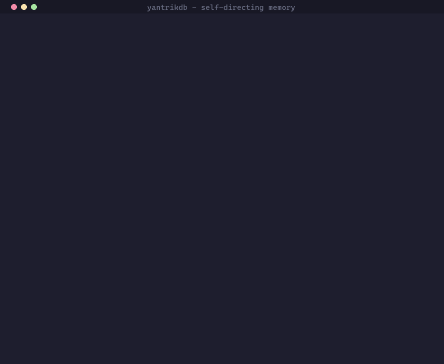

# Self-directing substrate — demo



The loop no other Hermes memory provider can do: the memory **notices what it
doesn't know, queues the work, hands the agent its own agenda, and closes the
loop** when the gap is answered.

1. The agent asks things the memory can't answer → **knowledge gaps** accrue.
2. On **session end**, each recurring gap becomes a durable **task**.
3. The next session opens with **"## Your memory's agenda"** — open tasks +
   unresolved gaps — surfaced automatically.
4. The agent learns one thing and records it → recall now answers it → the
   matching task is closed → the agenda shrinks.

Built entirely on the v0.7 primitives (`knowledge_gaps` + `tasks`). All
opt-in:

```bash
YANTRIKDB_AUTO_GAP_TASKS=true        # gaps -> tasks on session end
YANTRIKDB_SURFACE_AGENDA=true        # surface the agenda each session
YANTRIKDB_GAP_MAX_AVG_TOP_SCORE=0.5  # gap threshold (tune per embedder)
```

## Run it

```bash
pip install "yantrikdb>=0.9.0" yantrikdb-hermes-plugin
python demos/self_directing_memory.py
```

## Regenerate the GIF

`demo.gif` is rendered from the demo's output by [`render.py`](./render.py)
— pure Pillow, no VHS/ffmpeg (VHS hangs on Windows):

```bash
pip install pillow
python assets/demos/self-directing/render.py
```
